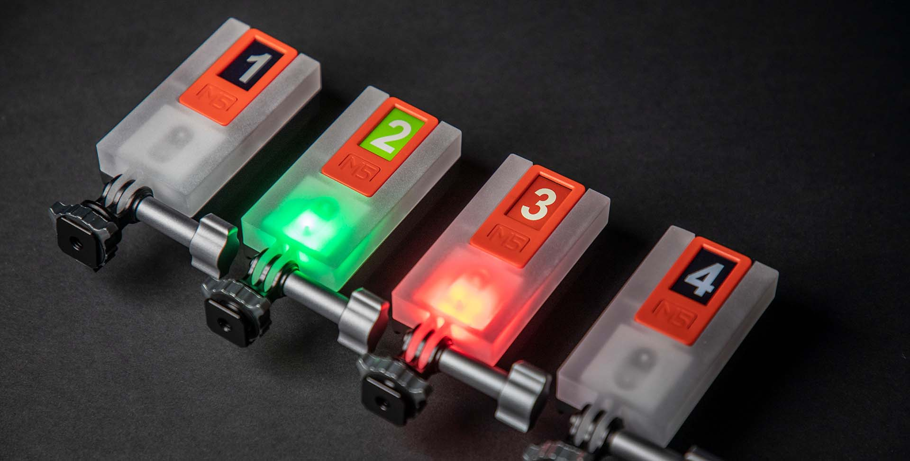
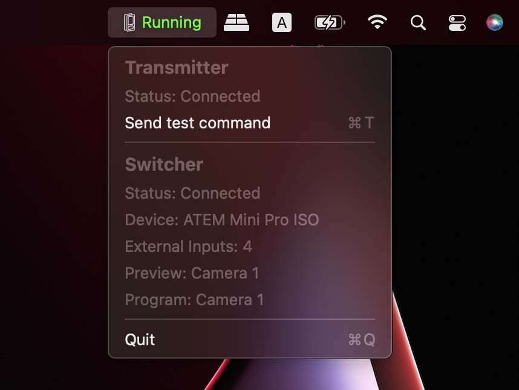
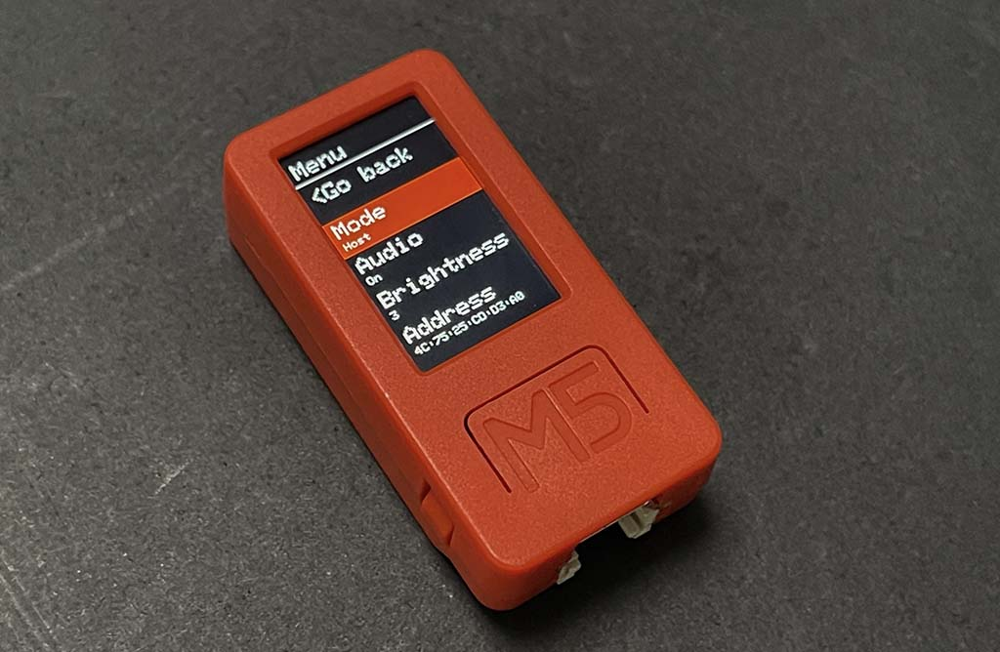
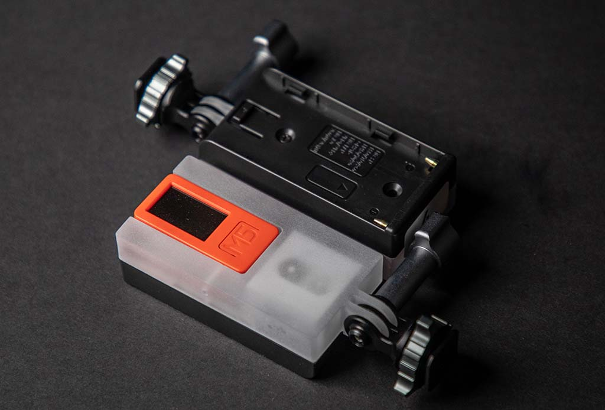
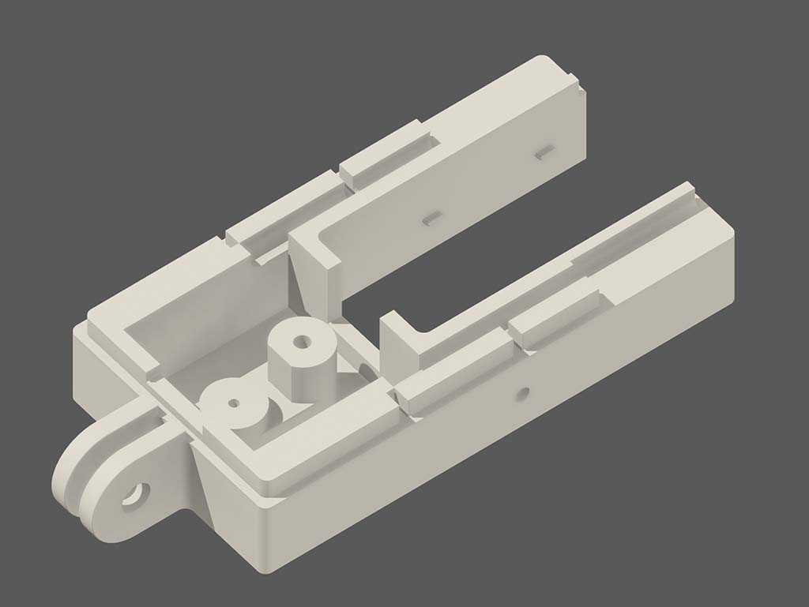
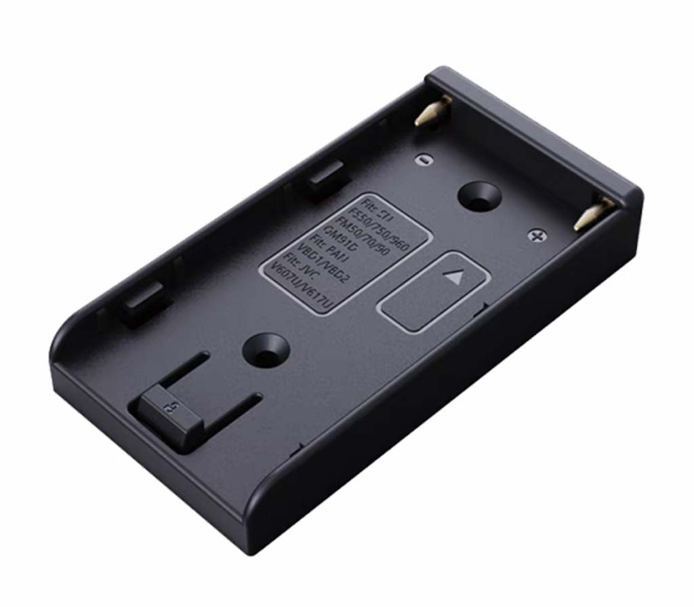
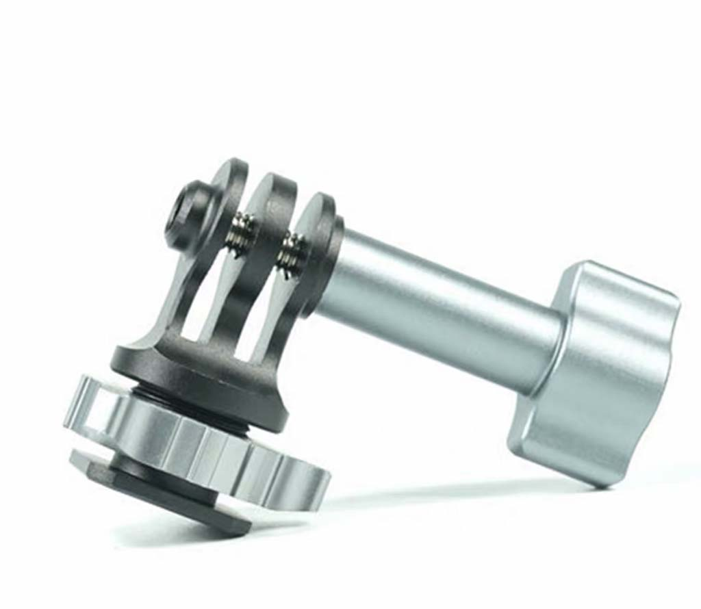
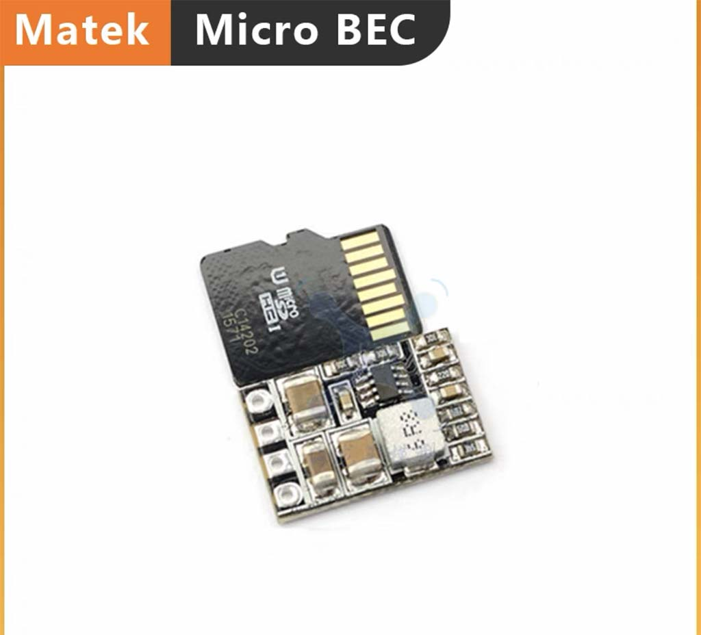
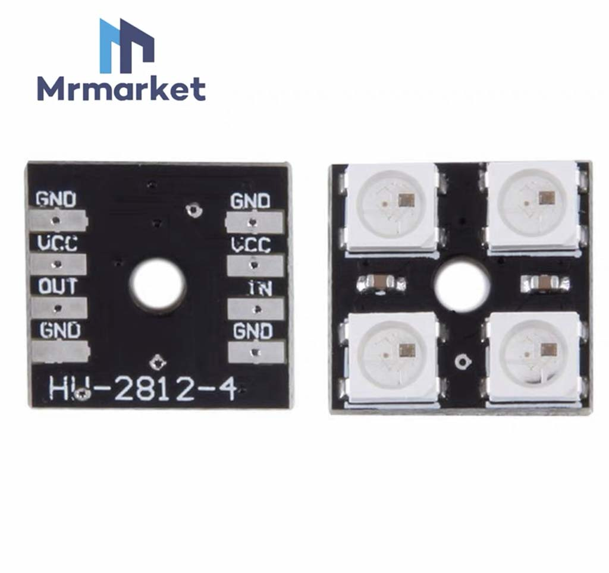
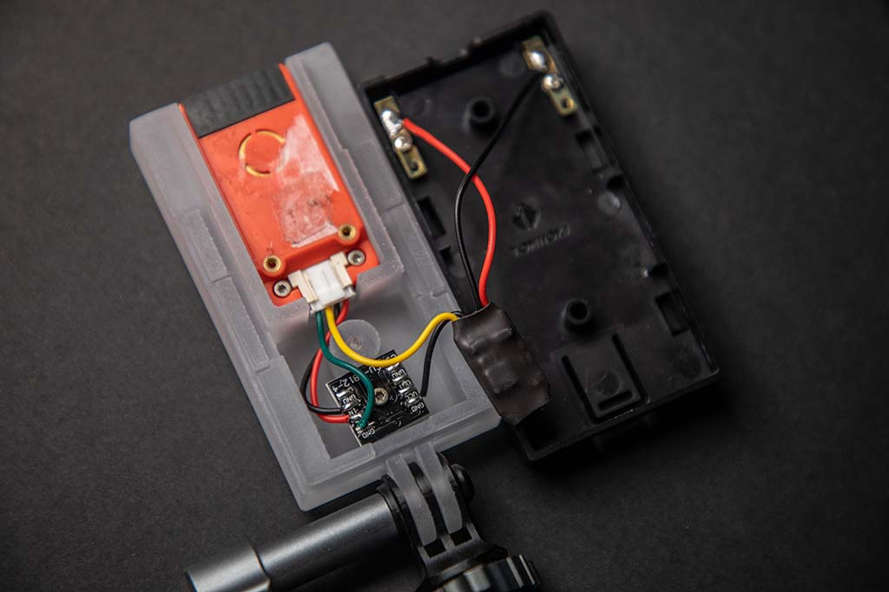

<h1 align="center">
	
</h1>

M5ATEMTally is an experimental project for wireless tally-light solution that make use of [**M5StickC PLUS**](https://shop.m5stack.com/products/m5stickc-plus-esp32-pico-mini-iot-development-kit "**M5StickC PLUS**") ($19.95 each) as both transmitter and receiver.

Disclaimer: this project has not been rigorously tested, if you intend to use it in a production scenario, please use it at your own risk.

## Highlights

- Connect to your ATEM Switcher with USB or IP address
- Up to 8 receivers
- 200 meters communication range in open field
- No pairing or Wi-Fi discover/connect needed, the connection can be established immediately after powered thanks to ESP-Now

## Prerequisites

- **Hardware**
	- M5StickC PLUS (each can be configured to either transmitter or receiver)
	- (Optionally) DIY Housing
- **Software**
	- ATEM Software Control
	- Xcode
	- PlatformIO

## Host program

The host program does nothing but attempt to connect and bridge the transmitter and ATEM switcher.

## Built-in simple menu

There is a built-in simple menu for adjust operating modes (transmitter or receiver and corresponding camera number), buzzer enabling, external LED brightness.

## DIY Housing

This solution will add flexibility to the receiver,  includes: NPF battery plate for power supply, external LEDs, hot shoe mount.
However, the current solution implementation is flawed, it involkes ugly modifications on the M5StickC inside, you need to:
- Remove the built-in battery
- Solder **5V IN** to **5V OUT** on Grove port with jumper wire
- Solder **3V3** pin to **G33** on Grove port with jumper wire

### Materials
|Name|Image|Description|
|--|--|--|
|3D Printed Housing|  |Mine is printed with SLA printer using transparent material, then polished into semi-transparent. CAD files can be found in the project|
|NPF Battery Plate||[[Link]](https://m.tb.cn/h.fxDksOg?tk=HeTJ2KcL6oS)|
|Hot Shoe Adapter||[[Link]](https://m.tb.cn/h.fxDjg1W?tk=GtcP2Kclxg4)|
|Voltage Regulator||7-21V to 5V [[Link]](https://m.tb.cn/h.fwCe7iw?tk=xcGL2KcN8Uq)|
|2x2 WS2812B LED||[[Link]](https://m.tb.cn/h.fwCeQ7C?tk=8UaP2KcOv7h)|

